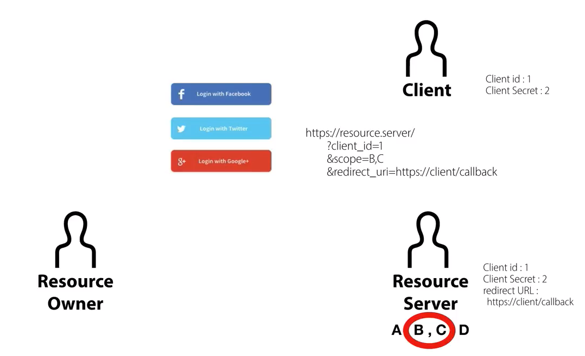
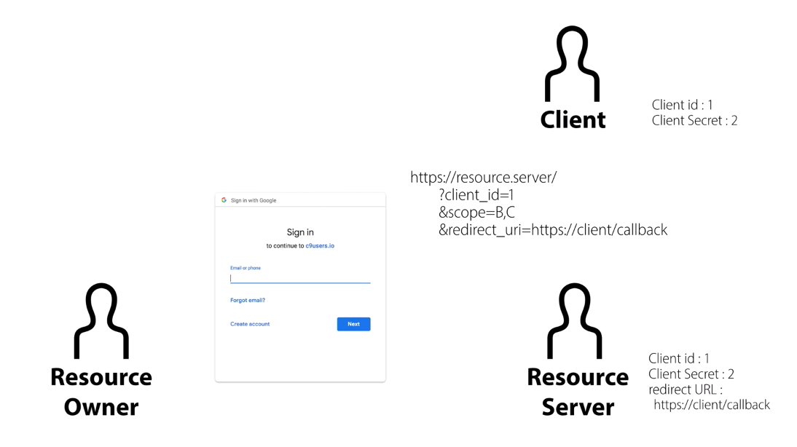
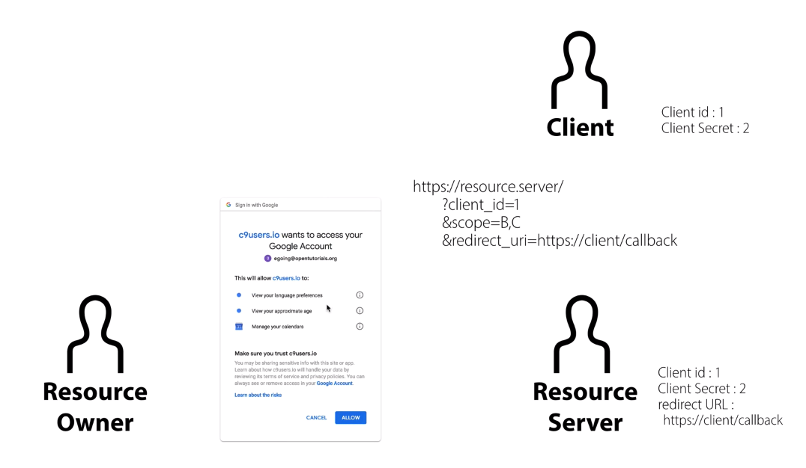
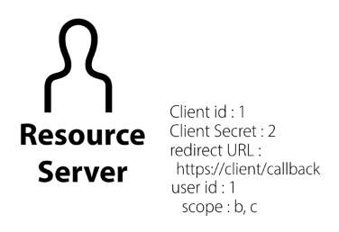
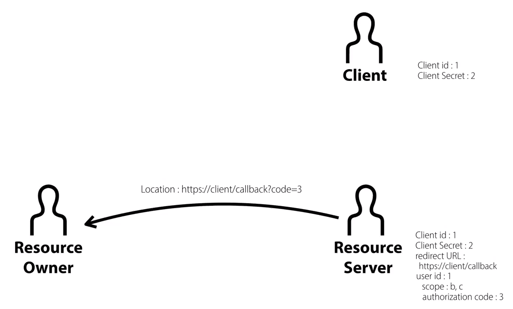
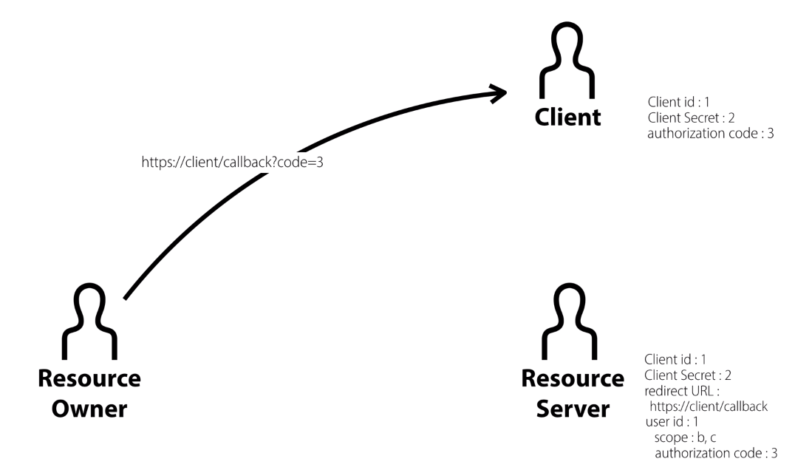
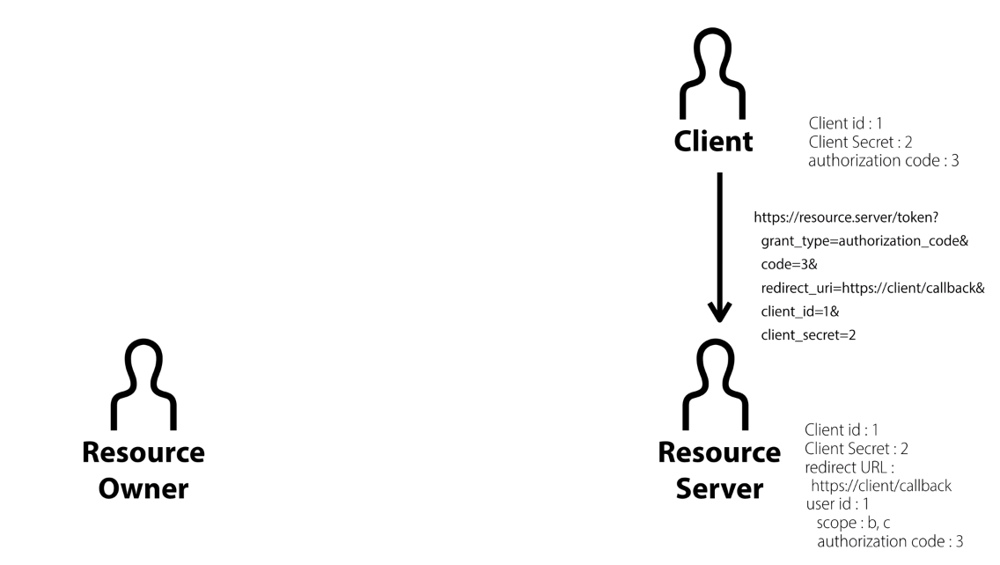
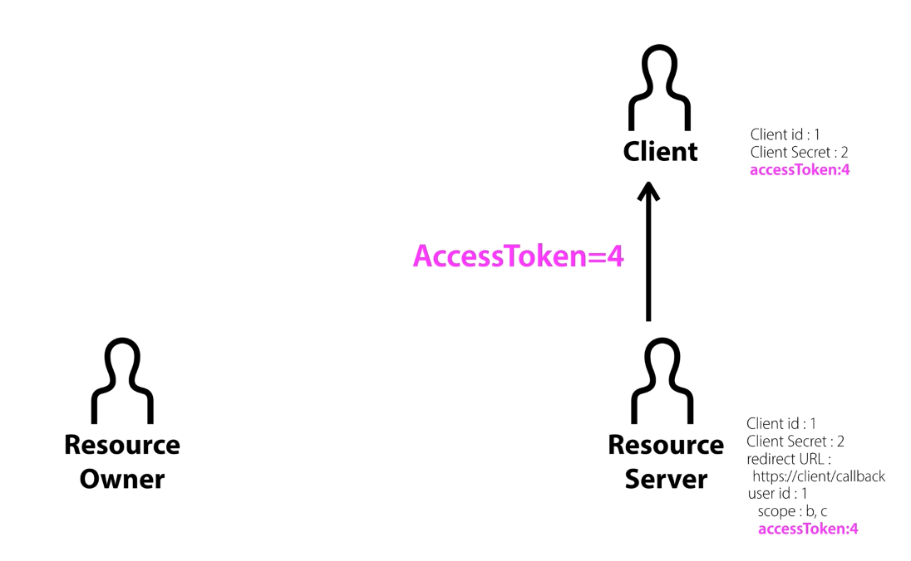

# Concepts of OAuth 2.0 [](https://creativecommons.org/licenses/by/4.0/)

This document has been written by translating, outlining, and spicing up the original contents of the public online course **[_WEB2 - OAuth 2.0_](https://opentutorials.org/course/3405)** by **[_opentutorials_](https://opentutorials.org)** in compliance with **[Creative Commons license (By)](https://github.com/anselhong1445/OAuth-2.0-Concepts/blob/master/LICENSE)**.

## 1. Cover Page

### 1.1. 3 Participants of traditional 3rd party authentication

1. **User**

2. **Mine**: ex) opentutorials.org

3. **Their** (3rd party): Google, Facebook, Twitter

- Hypothetically, Mine stands between User and Their. Mine receives ID and password from User and provide them to the API’s of Theirs. This could pose a significant security threat because Mine cannot be trustworthy all the time.

### 1.2. Security Issue: Access-Token

- **Access-token** replaces User having to provide ID and password to Mine. Furthermore, different access token is to be issued for the identical user based on permission scope for the 3rd party’s service that has been specifically request by the user so that all access-tokens gain different access to the 3rd party’s service.

### 1.3. Federated Identity

- **Federated Identity** is a technology / method that allows Mine to bypass having to create and maintain their own user information (id, password…)
- **OAuth** is a standard for federated identity
- There are services that have implemented OAuth standards like those of Google, Facebook, Twitter…
- **OAuth** is to be implemented (as APIs) by application programming languages like Java, Javascript, PHP, Ruby…

## 2. Role

### 2.1. OAuth’s Terminology for 4 Participants

1. **Resource Owner** -> User

2. **Client** -> Mine: ex) opentutorials.org

3. **Resource Server** -> Their (3rd party): Google, Facebook, Twitter…: Server that contains data (resource)

4. **Authorization Server (newly added participant)**: Server that processes authorization-related tasks. At times, resource server refers to both resource server and authorization server.

## 3. Registration

### 3.1. Register

- For a client to use the services of a resource server, the client is required to gain authorization from the resource server ahead of time and this is referred to as “register.”

### 3.2. How to register?

- Procedures of registration might vary with each service, but there are **several data** that are commonly used across:
  (0.Create app: for Facebook, create app at `https://developers.facebook.com/`; for Google create app at `https://console.cloud.google.com`…)

1. **Client ID**: to identify a client who uses the services of a resource server
2. **Client Secret**: to serve as a passcode for a corresponding client ID: this should not be exposed!
3. **Authorized redirect URLs**: to be an URI to which a client has asked a resource server to send an authorized code. The resource will ignore requests that have been made from any URL that is not the authorized redirect URL.

## 4. Approval of Resource Owner

### 4.1. Approval of Resource Owner

- **The very first step of OAuth** is for a resource owner to notify a resource server that it approves of a client having access to its resources.

### 4.2. Scenario

1. The client will display the page like the following picture (the one with 3 coloured buttons) before the log-in page provided by the resource server. **The links** would contain the value of “src” attribute like `https://resource-server/?client_id=1$scope=B,C&redirec_url=https://client/callback.`
   
   

2. If the resource owner click the link, the resource server will send its log-in page back to the resource owner.
   

3. Upon successful login of the resource owner, the resource server will identify the client with client ID in the URL’s query string (client_id=1). If the resource server confirms that the client ID exists, it will check if the request had been made from a valid redirect URL by matching up the redirect URL in the URL’s query string (redirect_url=https://client/callback) with the registered redirect URL in the resource sever’s database.

4. If the redirect URL has been verified, the resource server will check scope value in the URL (scope=B,C) and will create a page based on the scope values and display the page where it asks the resource owner whether he or she would like to allow the client access to the corresponding resources to the scope.
   
   

5. If the resource owner clicks “allow” button, the resource server will store the data like the following picture in its own database, “the user with user_id 1 has allowed the client with client_id 1 the access to the resources owned by the user in scope b and c.”
    

## 5. Approval of Resource Server

### 5.1. Approval of Resource Server: Authorization Code

- **“Authorization Code”** acts as a temporary passcode

- To authenticate a client (check if the client has been registered to a resource server), a resource server passes authorization code to the client via a resource owner. The client transmits the attained authorization code value and client secret to the resource server with which the client verifies itself to the client.

NOTE: the resource server does not directly pass authorization code to client but via the resource owner

### 5.2. Scenario

1. The resource server sends authorization code to the resource owner along with the response:

- Header: location(redirection)
- URL: `https://client/callback?code=3` (redirect URL and query string that contains the authorization code in it)
  

2. By the response from the resource server, the resource owner is to be redirected to `“https://client/callback?code=3”` and provides the client with authorization code (authorization code: 3)
   

3. Now with the virtue of authorization code, the client has attained the ability to directly access the resource server, not via the resource owner.
   

4. The resource server that has received the request from the client is to search its database for the authorization code (code=3) and to fetch according information: authorization code 3 has been issued to client with client_id 1. The resource server then compare the information (client_id, client secret, and redirect URL) in its database with the one provided along with the request (`http://resource.server/…code=3&redirect_url…client_id=1&client_secret=2`).

5) If the resource has confirmed that the both information matches up, it will provide the client with access token.

## 6. Access Token: the Heart of OAuth

### 6.1. Scenario

1. After the authentication on the client by means of authorization code (from the client to the resource server), both side of the client and the resource server purge authorization code so that they don’t repeat the authentication process unnecessarily.

2) The resource server then creates access-token, sends it to the client and the client client keeps the access-token. From that point, when the client make a request with the access-token, the resource server maps the access token with the data(user_id, scope: b,c…) that belong to it and provides the resources of the resource user in the scope: the client with accessToken 4 is now able to get the resources of the resource user with user_id 1 in scope b and c)
   

## 7. API

- Clients could make requests via APIs (offered from resource servers) that fetch data based on the resources owned by resource owners by attaching valid access token to tthe APIs like the following:

```smalltalk
// HTTP GET example of Google Identity Platform (which is based on OAuth 2.0) using Google Calendar APIs:

1. GET https://www.googleapis.com/drive/v2/files?access_token=<access_token>

2. GET https://www.googleapis.com/calendar/v3/users/me/calendarList

The request with API would appear as the following:
https://www.googleapis.com/calendar/v3/users/me/calendarList?access_token=<access_token>
```

## 8. Refresh token

### 8.1. Lifespan of Access Token

- All access tokens have their own lifespan: it could last just for few hours, a few days, or even months. If access token has expired, a client can no longer retain access passing the access token to the API.

### 8.2. Refresh Token

- Starting over the entire authorization and authentication process of OAuth seems to be unnecessary and repetitive and this is why Refresh Token comes in.

```smalltalk
1.5.  Refresh Token

   Refresh tokens are credentials used to obtain access tokens.  Refresh
   tokens are issued to the client by the authorization server and are
   used to obtain a new access token when the current access token
   becomes invalid or expires, or to obtain additional access tokens
   with identical or narrower scope (access tokens may have a shorter
   lifetime and fewer permissions than authorized by the resource
   owner).  Issuing a refresh token is optional at the discretion of the
   authorization server.  If the authorization server issues a refresh
   token, it is included when issuing an access token (i.e., step (D) in
   Figure 1).

   A refresh token is a string representing the authorization granted to
   the client by the resource owner.  The string is usually opaque to
   the client.  The token denotes an identifier used to retrieve the
   authorization information.  Unlike access tokens, refresh tokens are
   intended for use only with authorization servers and are never sent
   to resource servers.

+--------+                                           +---------------+
  |        |--(A)------- Authorization Grant --------->|               |
  |        |                                           |               |
  |        |<-(B)----------- Access Token -------------|               |
  |        |               & Refresh Token             |               |
  |        |                                           |               |
  |        |                            +----------+   |               |
  |        |--(C)---- Access Token ---->|          |   |               |
  |        |                            |          |   |               |
  |        |<-(D)- Protected Resource --| Resource |   | Authorization |
  | Client |                            |  Server  |   |     Server    |
  |        |--(E)---- Access Token ---->|          |   |               |
  |        |                            |          |   |               |
  |        |<-(F)- Invalid Token Error -|          |   |               |
  |        |                            +----------+   |               |
  |        |                                           |               |
  |        |--(G)----------- Refresh Token ----------->|               |
  |        |                                           |               |
  |        |<-(H)----------- Access Token -------------|               |
  +--------+           & Optional Refresh Token        +---------------+

               Figure 2: Refreshing an Expired Access Token

   The flow illustrated in Figure 2 includes the following steps:

   (A)  The client requests an access token by authenticating with the
        authorization server and presenting an authorization grant.

   (B)  The authorization server authenticates the client and validates
        the authorization grant, and if valid, issues an access token
        and a refresh token.

   (C)  The client makes a protected resource request to the resource
        server by presenting the access token.

   (D)  The resource server validates the access token, and if valid,
        serves the request.

   (E)  Steps (C) and (D) repeat until the access token expires.  If the
        client knows the access token expired, it skips to step (G);
        otherwise, it makes another protected resource request.

   (F)  Since the access token is invalid, the resource server returns
        an invalid token error.
```

## 8.2. Refresh Token Example (Google Identity Platform’s Refreshing an access token)

The following snippet shows a sample request:

```http
POST /oauth2/v4/token HTTP/1.1
Host: www.googleapis.com
Content-Type: application/x-www-form-urlencoded

client_id=<your_client_id>&
client_secret=<your_client_secret>&
refresh_token=<refresh_token>&
grant_type=refresh_token
```

As long as the user has not revoked the access granted to the application, the token server returns a JSON object that contains a new access token. The following snippet shows a sample response:

```json
{
  "access_token": "1/fFAGRNJru1FTz70BzhT3Zg",
  "expires_in": 3920,
  "token_type": "Bearer"
}
```

Note that there are limits on the number of refresh tokens that will be issued; one limit per client/user combination, and another per user across all clients. You should save refresh tokens in long-term storage and continue to use them as long as they remain valid. If your application requests too many refresh tokens, it may run into these limits, in which case older refresh tokens will stop working.

## References

- https://opentutorials.org
- https://opentutorials.org/course/3405
- https://developers.facebook.com
- https://console.cloud.google.com
- https://tools.ietf.org/html/rfc6749#section-1.5
- https://developers.google.com/identity/protocols/OAuth2WebServer

## Authors

- **[Sangsik Hong](https://github.com/anselhong1445)** - see **[the portfolio site for information of the author](https://anselhong1445.github.io)**
